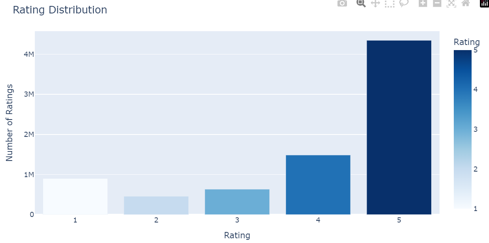
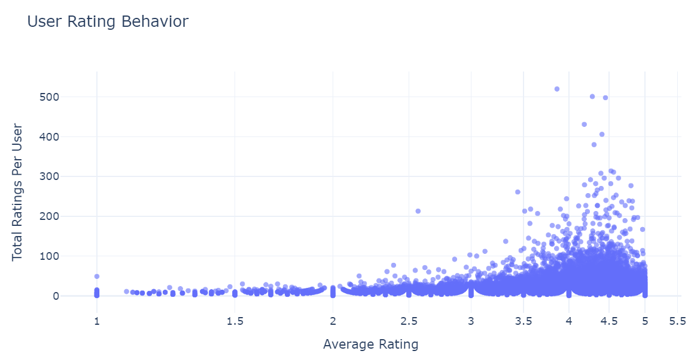

# Recommendation System
This project explores building a recommendation system based on product ratings.

# Dataset
The dataset used is the open-source Amazon Product Ratings data, which consists of the following columns:
- userId – Unique identifier for each user.
- productId – Unique identifier for each product.
- Rating – The rating given by a user to a product (typically on a scale of 1 to 5).
- Timestamp – The time when the rating was recorded.
#### Key Insights from the Dataset:

Users tend to give positive reviews unless the product is highly unsatisfactory, in which case they rate it as 1.0.

While most users have rated fewer than 100 products, some have provided as many as 520 ratings.
# Model
This project explores Collaborative Filtering, specifically:
- Item-Based Collaborative Filtering
- TimeSVD++ (which incorporates time dynamics in recommendations)

# Results
- Overlap Rate / Hit Rate: 60.17% of users had at least one correct recommendation in their top 5. This means most users received at least one good suggestion.
- Precision: 12.42% of recommended products were actually purchased by users.
- Recall: 62.12% of all purchased products were successfully recommended. This means that across all purchases, a large portion was correctly predicted.
- Lift Score: The model is 13x better than randomly recommending popular products. A lift score this high indicates strong recommendation effectiveness.

# Future Improvement
The model could be improved by incorporating:
- User behavior & preferences (e.g., browsing history, session duration)
- Product metadata (e.g., descriptions, categories, and sales history)

